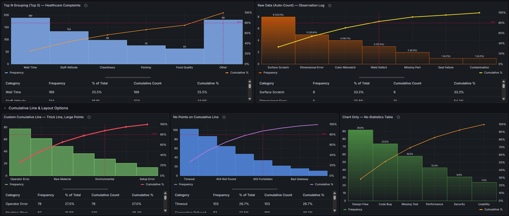
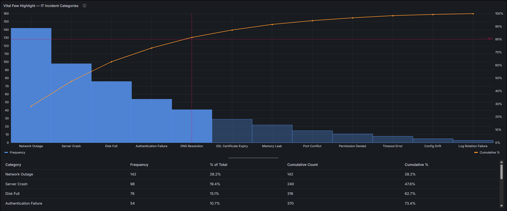
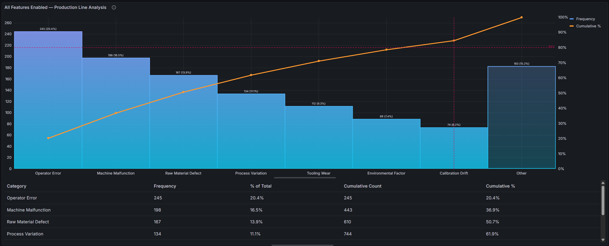
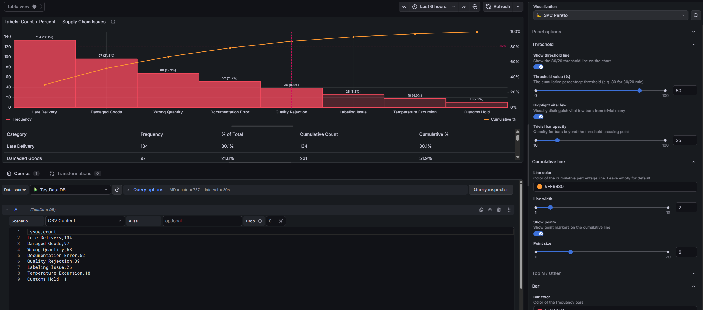

# SPC Pareto


The SPC Pareto panel helps you identify the most significant factors contributing to defects, downtime, or any categorical issue — so you can focus improvement efforts where they matter most.

 

## Why SPC Pareto?

The **Pareto principle** (80/20 rule) states that roughly 80% of effects come from 20% of causes. This plugin makes that insight instantly visible:

- **Bars sorted by impact** — categories are automatically ranked from highest to lowest frequency, making the biggest contributors immediately obvious
- **Cumulative percentage line** — a running total overlay shows how quickly contributions accumulate toward 100%
- **80/20 threshold line** — a configurable threshold line highlights where the "vital few" end and the "trivial many" begin



## Built for Grafana

SPC Pareto is built using Grafana's native visualization components. This means it inherits the look, feel, and behavior you already know:

- **Native theming** — automatically adapts to light and dark mode
- **Standard panel options** — legend placement, tooltip behavior, and field overrides work just like any other Grafana panel
- **Resizable statistics table** — drag the splitter to balance chart and table space, just like Grafana's built-in panels
- **Works with any data source** — use it with SQL databases, Prometheus, InfluxDB, CSV files, or any other Grafana data source

## Features

| Feature | Description |
|---------|-------------|
| Raw data support | Accepts ungrouped observations and counts occurrences automatically |
| Automatic sorting | Categories are ranked by frequency — no manual ordering needed |
| Dual y-axes | Left axis shows frequency counts, right axis shows cumulative percentage (0–100%) |
| Threshold line | Configurable threshold (default 80%) with horizontal and vertical reference lines |
| Vital few highlight | Bars beyond the threshold crossing point are visually muted, making the vital few stand out |
| Cumulative line | Customizable color, width, and point markers |
| Top N / Other grouping | Collapse low-frequency categories into an "Other" bucket to reduce noise |
| Value labels | Optional count, percentage, or both displayed above each bar |
| Statistics table | Interactive table with category, frequency, % of total, cumulative count, and cumulative % |
| Resizable layout | Drag the splitter between chart and table to adjust the view |



## Use Cases

- **Manufacturing quality** — identify top defect types across production lines
- **IT operations** — rank incident categories to prioritize root cause analysis
- **Customer support** — surface the most common complaint categories
- **Software development** — analyze bug categories, test failure reasons, or build errors
- **Supply chain** — rank supplier issues or shipment delay causes

## Requirements

- Grafana **11** or later

## Getting Started

1. Install the plugin from the [Grafana Plugin Catalog](https://grafana.com/grafana/plugins/kensobi-spcpareto-panel/)
2. Add a new panel and select **SPC Pareto** as the visualization
3. Configure a query that returns either:
   - A **string field** + a **number field** (pre-aggregated categories and counts), or
   - A **string field** only (raw observations — the plugin counts occurrences automatically)
4. The chart automatically sorts, calculates cumulative percentages, and renders the Pareto view



### Example Query (SQL — pre-aggregated)

```sql
SELECT defect_type AS category, COUNT(*) AS count
FROM inspections
WHERE $__timeFilter(inspection_time)
GROUP BY defect_type
```

### Example Query (SQL — raw observations)

```sql
SELECT defect_type
FROM inspections
WHERE $__timeFilter(inspection_time)
```

The plugin counts occurrences of each unique `defect_type` value automatically.

### Example Query (TestData)

For a quick demo, use the **TestData** data source with the **CSV Content** scenario:

```csv
category,count
Scratch,45
Dent,38
Contamination,29
Misalignment,22
Color Defect,15
Crack,12
Burr,8
Warping,6
Porosity,4
```

## Panel Options

### Threshold

| Option | Description | Default |
|--------|-------------|---------|
| Show threshold line | Display the 80/20 reference lines | On |
| Threshold value | Cumulative percentage threshold | 80% |
| Highlight vital few | Visually mute bars beyond the threshold crossing point | Off |
| Trivial bar opacity | Opacity for the muted "trivial many" bars (10–100%) | 40% |

### Cumulative line

| Option | Description | Default |
|--------|-------------|---------|
| Line color | Color of the cumulative percentage line | Orange |
| Line width | Stroke width of the cumulative line | 2 |
| Show points | Show point markers on the cumulative line | On |
| Point size | Size of point markers | 5 |

### Top N / Other

| Option | Description | Default |
|--------|-------------|---------|
| Limit categories | Group low-frequency categories into an "Other" bucket | Off |
| Show top N categories | Number of categories to show before grouping the rest | 10 |

### Bar

| Option | Description | Default |
|--------|-------------|---------|
| Bar color | Color of the frequency bars | Blue |
| Fill opacity | Bar fill opacity (0–100%) | 80% |
| Line width | Bar border width | 1 |
| Gradient mode | None, Opacity, or Hue | None |
| Show value labels | Display labels above each bar | Off |
| Label content | Count, % of Total, or Both | Count |

### Statistics table

| Option | Description | Default |
|--------|-------------|---------|
| Show statistics table | Display the interactive statistics table | On |

## Documentation

For detailed documentation, configuration guides, and examples, see the [full documentation](https://docs.kensobi.com/panels/spc-pareto/).

## Part of the KensoBI SPC Suite

SPC Pareto is part of a growing family of **Statistical Process Control** plugins for Grafana by Kenso Software:

**[SPC Chart Panel](https://github.com/KensoBI/spc-cad)** — Control charts for monitoring process stability over time. Supports Xbar-R, Xbar-S, and XmR charts with automatic calculation of control limits. If you're tracking whether a process is staying in control, this is your starting point.

**[SPC Histogram Panel](https://github.com/KensoBI/spc-histogram)** — Distribution analysis with histograms, bell curves, and a built-in statistics table showing Cp, Cpk, Pp, and Ppk. Use it to understand process capability: is your process producing results within specification limits?

**[SPC CAD Panel](https://github.com/KensoBI/spc-cad)** — Brings 3D geometry into the picture, letting you bind the data from control charts and histograms to physical features on your parts.


## Development Setup

### Prerequisites

- Node.js (LTS version recommended)
- npm or yarn
- Docker (for local Grafana instance)

### Installation

1. Clone the repository

   ```bash
   git clone https://github.com/kensobi/spc-pareto.git
   cd spc-pareto
   ```

2. Install dependencies

   ```bash
   npm install
   ```

### Development Workflow

1. **Build plugin in development mode with watch**

   ```bash
   npm run dev
   ```

2. **Run Grafana locally**

   ```bash
   npm run server
   ```

   Access Grafana at `http://localhost:3000` (default credentials: admin/admin)

3. **Build plugin for production**

   ```bash
   npm run build
   ```

### Testing

**Unit Tests (Jest)**

```bash
# Run tests in watch mode (requires git init first)
npm run test

# Run tests once (CI mode)
npm run test:ci
```

**E2E Tests (Playwright)**

```bash
# Start Grafana instance first
npm run server

# Or specify a Grafana version
GRAFANA_VERSION=11.3.0 npm run server

# Run E2E tests
npm run e2e
```

**Linting**

```bash
npm run lint

# Auto-fix issues
npm run lint:fix
```

## Building and Packaging

### Development Build

```bash
npm run dev
```

Builds the plugin with source maps and watches for changes.

### Production Build

```bash
npm run build
```


## Contributing

We welcome contributions, feedback, and feature requests!

1. Fork the repository
2. Create a feature branch (`git checkout -b feature/amazing-feature`)
3. Make your changes
4. Run tests (`npm run test:ci`)
5. Run linter (`npm run lint:fix`)
6. Commit your changes
7. Push to your fork
8. Open a Pull Request

Please open an [issue](https://github.com/kensobi/spc-pareto/issues) to discuss major changes before submitting a PR.


## License

This software is distributed under the AGPL-3.0-only license — see [LICENSE](LICENSE) for details.

## Support

If you have any questions or feedback, you can:

- Ask a question on the [KensoBI Discord channel](https://discord.gg/bekfAuAjGm).
- GitHub Issues: https://github.com/kensobi/spc-pareto/issues
- Grafana Community: https://community.grafana.com/